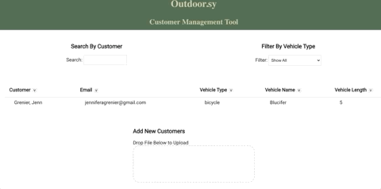
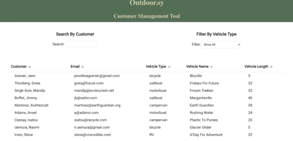

# Outdoor.sy Customer Management Tool - Back End
Ourdoor.sy Customer Management Tool is an application for the mock company Outdoor.sy to list, search, and sort their customers. 
[View Front End Repo](https://github.com/JAGrenier/Outdoor.sy_Front_End)

## Features
### File Upload

 
Users can upload customer data by dragging and dropping at file in the indicated space. The input cusomter information will then render in the customer table. 
 
### Search, Filter, and Sort 
 
 
Users can search customers by typing the cusomter first or last name in the search box. The table can be fitlered to show only customers with a specifcaly vehicle type. The table can also be sorted by any of the table headings.  

## Technologies and Tools
**Front End** React.js

**Back End** Ruby on Rails, PostgreSQL

## How To Open
1. Clone the code form GitHub onto your local machine 
2. With Ruby already installed open the code in a text editor
3. Run Bundle Install, Rails db:migrate, rails db:seed, rails s (make sure to open server on port 3000) 

## Contact
You can find me on [LinkedIn](https://www.linkedin.com/in/jagrenier/)

